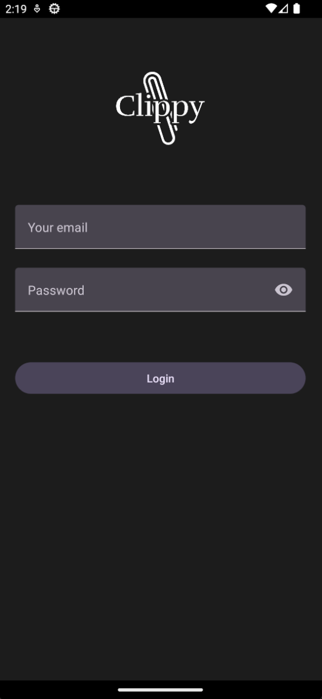

# Survivor - "Clippy"

Survivor is our 3rd year project at EPITECH for the introduction seminar. This
consists of a mobile application running with React Native and Expo. Its goal
is to show a trombinoscope of a company, and add some widgets to it.

We opted for a main view with draggable widgets, to allow customisation.
We integrated a instantaneous chat system using a simple backend running with
NextJS 13. Images are cached to allow for faster loading time. i18n is also
supported in the app, and a discord webhook was added.

We made this project in group of 2-3 in 2 weeks, the goal was to have an MVP by
the end of first week and answer to the client's requests during the second
week.

